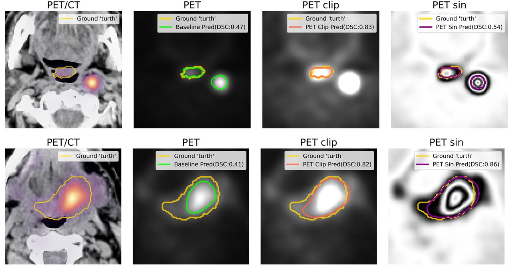

# PET/CT Head and Neck tumor auto-segmentation

This is a repository for competition of MICCAI 2021: HECKTOR - head and neck gross tumor volume(GTV) segmentation.
### PET Normalizations to Improve Deep Learning Auto-Segmentation of Head and Neck Tumors in 3D PET/CT and Various Attempts at Patient Outcome Prediction
Jintao Ren1[0000-0002-1558-7196], Bao-Ngoc Huynh2[0000-0001-5210-132X)], Aurora Rosvoll Groendahl2[0000-0003-1327-3844], Oliver Tomic2[0000-0003-1595-9962],  Stine Sofia Korreman1[0000-0002-3523-382X], Cecilia Marie Futsaether2[0000-0001-7944-0719]


 


## Prerequisites:

HECKTOR public code for resample images to istropical 1mm grid with bounding box(144x144x144):

```
git clone https://github.com/voreille/hecktor
cd hecktor/src/resampling/
python resample.py
```

We use nnUNet as the baseline model for the development of GTV multimodality segmentation network.
install  nnUNet:
```
git clone https://github.com/MIC-DKFZ/nnUNet.git
cd nnUNet
pip install -e .
```

convert data:
We've provded a script to convert sampled image to nnUNet format. Please change the your file location for both `downloaded_data_dir` and `downloaded_data_dir_test`

if convert train set only:
```
python data_conversion.py
```

if conver both train and test set:
```
python data_conversion.py --test=True
```

## Evaluation
### Evaluation on 5-folds cross validation(CV)
Run evaluation on 5-folds CV using following command for task id XXX:

`nnUNet_find_best_configuration -m 3d_fullres  -t XXX --strict`
