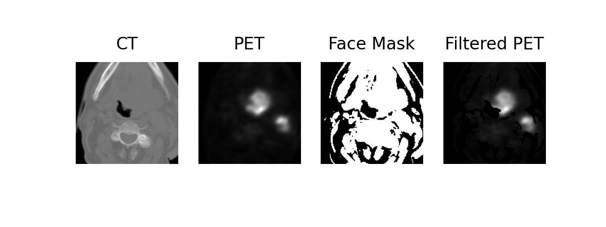
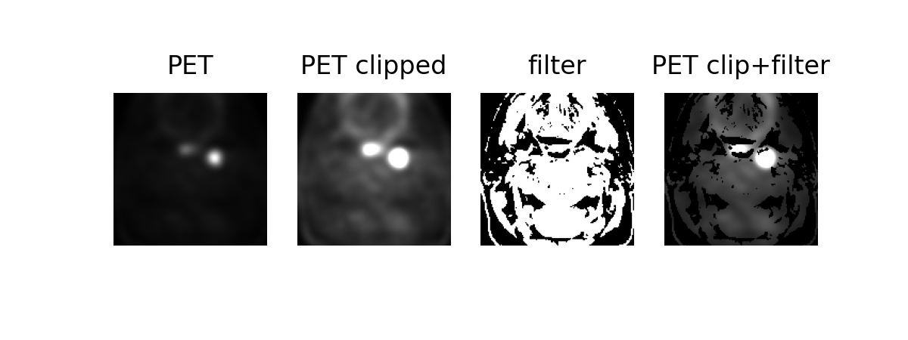

# PET/CT Head and Neck tumor auto-segmentation

This is a repository for competition of MICCAI 2021: HECKTOR - head and neck gross tumor volume(GTV) segmentation.


## Prerequisites:

HECKTOR public code for resample images to istropical 1mm grid with bounding box(144x144x144):

```
git https://github.com/voreille/hecktor
cd hecktor/src/resampling/
python resample.py
```

We use nnUNet as the baseline model for the development of GTV multimodality segmentation network.
install  nnUNet:
```
git clone https://github.com/MIC-DKFZ/nnUNet.git
cd nnUNet
pip install -e .
```

convert data:
We've provded a script to convert sampled image to nnUNet format. Please change the your file location for both `downloaded_data_dir` and `downloaded_data_dir_test`

if convert train set only:
```
python data_conversion.py
```

if conver both train and test set:
```
python data_conversion.py --test=True
```
## PET image preprocessing 
### Change resampled image folder
In `path.py`, changed `resample_path` to your own resampled path. 


### option 1. Filter PET by face mask
PET has a poor spatial contrast, and its blurry boundery may highlight areas where there is no tissue. We utilized a facial mask to filter the PET image to diminish the impact.
'PatientID_ptfx.nii.gz' PET filtered images would be saved to your resampled path. 
```
python pet_face_mask_filter.py
```

Similary, to convert the filtered PET run:

```
python data_conversion_pet_fm.py --test=True
```

The last image shows an example of face mask filtered PET:


### option 2. Clip PET
Clip PET by a value number or quantile percentage.'PatientID_ptc.nii.gz' PET clipped images would be saved to your resampled path. 

e.g. Clip PET by value numer 5. 
```
python pet_clipper.py --mode=number --clip=5
```
e.g. Clip PET by value quantile 0.98. 
```
python pet_clipper.py --mode=quantile --clip=0.98
```
Similary, to convert the clipped PET run:
```
python data_conversion_clip.py --test=True
```



## Evaluation
### Evaluation on 5-folds cross validation(CV)
Run evaluation on 5-folds CV using following command for task id XXX:

`nnUNet_find_best_configuration -m 3d_fullres  -t XXX --strict`
